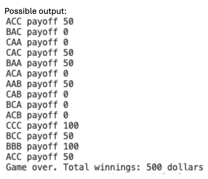

# Project Title
Tickets
## Description
A short paragraph explaining what the project is and what it does.

## Requirements
- PHP installed (version 8)
- Local server (XAMPP, MAMP etc,)
- Web browser

## Installation
1. Clone or download the repository.
2. Place the project folder into your server’s web root (e.g., `htdocs/` for XAMPP).
3. Start the server.

## Repo
[markleyclassroom](https://github.com/MarkleyClassroom/phplessonChapter2)

## Screenshot of homepage

## Markdown Cheat Sheet
[cheatsheet](https://www.markdownguide.org/cheat-sheet/)